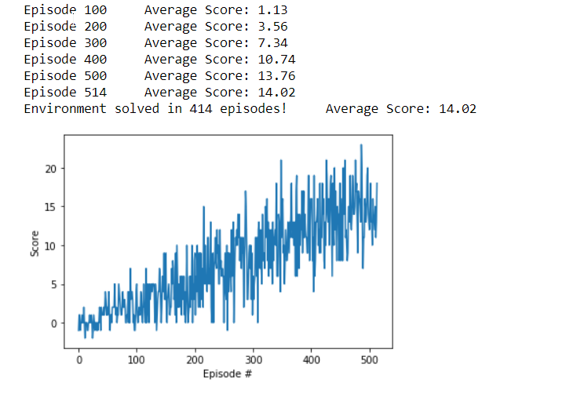

#1. Learning Algorithm

## Network Architecture

The network used is Double Deep Q Learning.

This network consists of 2 networks:
- The local network
- And the target network

The architecture of the local network and the target network are the same:
- The first layer has the same inputs as the state, and it has 50 neurons.
- There is a hidden layers with 50 neurons.
- And the last layer it outputs a vector with the Value of each action.

This network architecture is replicable to other games, not just this game.

The activation function used between layers, is RELU. 

## Why Double Deep Q Learning?
Because it avoids the bias that q-learning has and it reaches the goal of this project quicker than q-learning.

## How we learn from the environment

Every N steps, we take the last 64 experiences, and we learn from it.

We update the local network based on the experiences and the value function from the target network, then, the weights are transferred from the local network to the target network.

We're using the ADAM optimizer.  

#3. Plot of rewards

The plot of rewards are in the notebook
The environment got solved in 414 episodes with an Average Score of 14.02

#4. Future work

- **Try other network architectures:** We can test other network architectures such as RNN, CNN and improve the learning of the algorithm. 
- **Use the pixels instead of the state:** We could use the pixels and feed it into other network architecture such as CNN which is known to work good with images.
